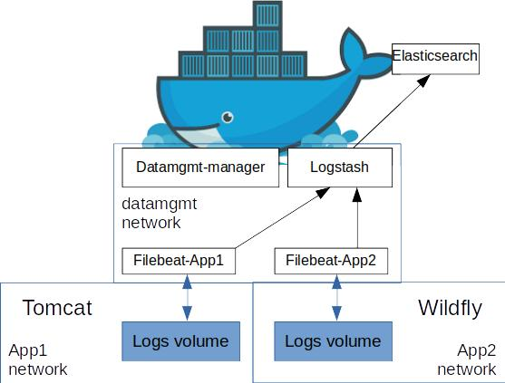

# datamgmt
Cloudunit logging management agent written in Go, will help you to handle container logging, especially for file logging.

# How does it work

This agent will listen on docker event and if specific labels have been set on the container, it will grep logs file inside the container with a filebeat agent and send the line to a logstash. Once the applicative container is deleted, logging container is deleted as well as the data stored in the elasticsearch backend

## Pre requisite

For the moment only filebeat agent is available to grep logs and logstash is used with elasticsearch to parse and store logs.
Configuration of the agent is done with a label ("application-type") wich have to be set to the application type of the container (tomcat, wildfly, ..) and the configuration file will be loaded.

# Contributing

## Setting up your dev environment

Current Go version used for development is Golang 1.7.4.

glide version 0.11.0-2

The location where you clone is important. Please clone under the source
directory of your `GOPATH`. If you don't have `GOPATH` already set, you can
simply set it to your home directory (`export GOPATH=$HOME`).

    $ mkdir -p ${GOPATH}/src/github.com/treeptik
    $ cd ${GOPATH}/src/github.com/treeptik
    $ git clone https://github.com/treeptik/datamgmt.git
    $ cd datamgmt && glide up
    $ GOOS=linux GOARCH=amd64 CGO_ENABLED=0 go build
